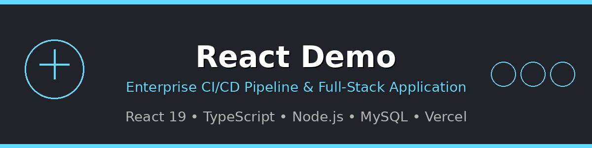

# Enterprise CI/CD Pipeline - React Full-Stack Application

<div align="center">



[](https://github.com/Serk4/React-Demo/actions/workflows/ci-cd.yml)
[](https://reactjs.org/)
[](https://www.typescriptlang.org/)
[](https://nodejs.org/)
[](https://vitejs.dev/)
[](https://react-demo-app-stable.vercel.app)
[](https://www.mysql.com/)
[](LICENSE)

A professional-grade full-stack web application demonstrating enterprise-level DevOps practices. Built with React 19, TypeScript, Node.js, and MySQL, featuring comprehensive CI/CD pipeline, microservices architecture, and intelligent deployment management with stable URL coordination.

</div>

## 🚀 Features

- **Enterprise CI/CD Pipeline**: Complete GitHub Actions automation with testing, security, and dual deployment
- **Microservices Architecture**: Independent frontend and backend deployments with stable URL coordination
- **React Frontend**: Modern React 19 with TypeScript and Vite
- **Professional UI**: Navigation menu with responsive design and user edit modals
- **User Management**: Complete CRUD interface with data tables and real-time updates
- **Node.js Backend**: Express.js REST API with MySQL database integration
- **MySQL Database**: Professional database migration from SQL Server to MySQL
- **Smart Fallback**: Graceful degradation from MySQL to in-memory storage
- **Automated Testing**: Comprehensive test suite with 28 API tests
- **Stable URL Management**: Solves microservices URL synchronization with Vercel aliases
- **Environment Strategy**: Professional dev/test/prod configuration management
- **Zero-Downtime Deployment**: Rolling updates with health checks
- **Database Migration Tools**: Complete migration scripts and documentation

## 📋 Prerequisites

- **Node.js** (v18 or higher)
- **npm** (v9 or higher)
- **MySQL** (Local development - XAMPP recommended for Windows)
- **Git** (For version control and CI/CD)
- **Vercel CLI** (Optional - for manual deployment)

## 🗄️ Database Options

### Local Development

- **XAMPP MySQL**: Easy Windows setup (recommended)
- **MySQL Server**: Direct installation
- **Docker MySQL**: Containerized setup
- **Fallback Mode**: In-memory storage if MySQL unavailable

### Production

- **PlanetScale**: Free tier, MySQL-compatible, serverless-optimized
- **Railway**: Simple setup with persistent storage
- **Vercel Storage**: Native Vercel integration (when available)
- **AWS RDS**: Enterprise-grade MySQL hosting

## 🧪 Testing & CI/CD

### Comprehensive Testing Suite

This project includes **28 automated tests** covering:

- **API Tests**: Complete CRUD operations (users.test.js - 21 tests)
- **Integration Tests**: Full workflow validation (integration.test.js - 4 tests)
- **Health Checks**: System connectivity (basic.test.js - 3 tests)
- **Mock Mode**: Tests work with or without database (perfect for CI/CD)

### Running Tests Locally

```bash
# Run all tests
cd server
npm test

# Run specific test files
npm test users.test.js
npm test integration.test.js
npm test basic.test.js

# Run tests with coverage
npm run test:coverage

# Watch mode for development
npm run test:watch
```

### CI/CD Pipeline with Vercel Deployment

The project uses **GitHub Actions** for automated testing and **dual Vercel deployment**:

#### 🔄 **Automated Triggers**

- **Every push** to `main` branch → Full pipeline + production deployment
- **Every push** to `feature/*` branches → Tests and validation
- **Pull requests** to `main` → Complete validation before merge

#### 🏗️ **Multi-Job Pipeline**

**1. Test Job (Windows + Node.js 20.x)**

```yaml
✅ Checkout code from repository
✅ Setup Node.js 20.x with dependency caching
✅ Install frontend & backend dependencies
✅ Run 28 comprehensive API tests (MySQL fallback mode)
✅ Build React frontend for production
✅ Verify build artifacts and exit codes
```

**2. Lint Job (Ubuntu)**

```yaml
✅ ESLint code quality validation
✅ TypeScript type checking
✅ Formatting and style verification
```

**3. Security Job (Ubuntu)**

```yaml
✅ npm audit vulnerability scanning
✅ Frontend & backend dependency checks
✅ Security warnings (non-blocking)
```

**4. Deploy Job (Ubuntu)**

```yaml
✅ Runs only on successful main branch pushes
✅ Deploys Frontend to Vercel (React SPA)
✅ Deploys Backend to Vercel (Node.js serverless)
✅ Updates production URLs automatically
✅ Environment-specific configuration
```

#### 📊 **Enterprise Deployment Architecture**

**🏗️ Microservices Design:**

- **Frontend Service**: `react-demo-app-stable.vercel.app` (Static React SPA)
- **Backend Service**: `react-demo-api-stable.vercel.app` (Node.js serverless functions)
- **Database Service**: MySQL (local) → In-memory (fallback) → Cloud MySQL (production)
- **Stable URL Strategy**: Permanent aliases that update deployment targets without changing environment variables

**🔄 Deployment Coordination:**

- **Problem Solved**: Eliminated the microservices URL synchronization Catch-22
- **Solution**: Vercel aliases provide stable URLs while actual deployments can change freely
- **Environment Variables**: `VITE_API_URL`, `VITE_TEST_API_URL`, `VITE_PROD_API_URL` use stable endpoints
- **Alias Management**: Update deployment targets without touching environment configuration

**🎯 Production URLs:**

- **Frontend**: https://react-demo-app-stable.vercel.app
- **Backend API**: https://react-demo-api-stable.vercel.app/api
- **Health Check**: https://react-demo-api-stable.vercel.app/api/health
- **Users API**: https://react-demo-api-stable.vercel.app/api/users

#### 🔍 **Pipeline Status**

Check the **Actions** tab in GitHub to see:

- ✅ Green checkmarks = All tests passing, deployment successful
- ❌ Red X = Failed tests/deployment (blocks production)
- 🟡 Yellow dot = Pipeline running

## 🛠️ Installation & Setup

### 1. Clone the Repository

```bash
git clone https://github.com/Serk4/React-Demo.git
cd react-demo
```

### 2. Install Dependencies

```bash
# Install frontend dependencies
npm install

# Install backend dependencies
cd server
npm install
cd ..
```

### 3. Database Setup (MySQL)

#### Option A: XAMPP (Recommended for Windows)

1. **Download XAMPP** from https://www.apachefriends.org/
2. **Install XAMPP** and start the MySQL service
3. **MySQL runs on** `localhost:3306` with user `root` (no password)

#### Option B: MySQL Server Direct Install

1. **Download MySQL Server** from https://dev.mysql.com/downloads/
2. **Install and configure** MySQL server
3. **Note your credentials** for environment configuration

#### Option C: Docker MySQL

```bash
docker run --name mysql-dev -e MYSQL_ROOT_PASSWORD=password -e MYSQL_DATABASE=react_demo -p 3306:3306 -d mysql:8.0
```

#### Verify MySQL Setup

```bash
cd server
node verify-mysql.js
```

This script will:

- ✅ Test MySQL connection
- ✅ Create `react_demo` database if needed
- ✅ Set up `users` table with sample data
- ✅ Display current data status

### 4. Environment Configuration

**Enterprise Environment Strategy:**

The application uses a professional 3-tier environment variable strategy:

- **VITE_API_URL**: Primary API endpoint (development/staging)
- **VITE_TEST_API_URL**: Testing environment API endpoint
- **VITE_PROD_API_URL**: Production API endpoint

**Automatic Environment Detection:**

```typescript
// In src/config/api.ts - Intelligent environment switching
const getApiBaseUrl = () => {
	// Development: localhost
	if (import.meta.env.DEV) {
		return 'http://localhost:3001/api'
	}

	// Production: Stable URL (never changes!)
	return (
		import.meta.env.VITE_API_URL ||
		import.meta.env.VITE_TEST_API_URL ||
		import.meta.env.VITE_PROD_API_URL
	)
}
```

**Vercel Environment Variables Setup:**

```env
# These URLs are STABLE - they never change even with new deployments
VITE_API_URL=https://react-demo-api-stable.vercel.app/api
VITE_TEST_API_URL=https://react-demo-api-stable.vercel.app/api
VITE_PROD_API_URL=https://react-demo-api-stable.vercel.app/api
```

**Local Development Backend (.env):**

```env
# MySQL Configuration (server/.env)
MYSQL_HOST=localhost
MYSQL_USER=root
MYSQL_PASSWORD=           # Empty for XAMPP default
MYSQL_DATABASE=react_demo
MYSQL_PORT=3306
```

## 🚀 Running the Application

### Development Mode

**Terminal 1 - Backend API:**

```bash
cd server
npm run dev
```

**Terminal 2 - React Frontend:**

```bash
npm run dev
```

The application will be available at:

- **Frontend**: http://localhost:5173 (or http://localhost:5174 if 5173 is busy)
- **Backend API**: http://localhost:3001
- **Health Check**: http://localhost:3001/api/health
- **Database Status**: Check console logs for MySQL connection status

### Production Mode

```bash
# Build the React app
npm run build

# Preview the built app
npm run preview
```

## 🌐 Enterprise Deployment Strategy

### Stable URL Management (Solves Microservices Coordination)

**The Challenge:** Traditional microservices face a URL synchronization Catch-22 where each deployment generates random URLs, making environment variables immediately outdated.

**Our Solution:** Professional stable URL aliases that can be updated to point to new deployments without changing environment variables.

#### Stable Production URLs

- **Frontend**: https://react-demo-app-stable.vercel.app
- **Backend API**: https://react-demo-api-stable.vercel.app/api
- **Environment Variables**: Always point to stable URLs, never change
- **Deployment Updates**: Aliases update to new deployment targets automatically

#### Alias Management Workflow

```bash
# Get latest deployments
vercel ls

# Update backend alias to latest deployment
vercel alias https://server-[new-id].vercel.app react-demo-api-stable

# Update frontend alias to latest deployment
vercel alias https://react-demo-[new-id].vercel.app react-demo-app-stable

# Environment variables never need updating!
```

### Database Migration Achievement

**Enterprise Migration:** Successfully migrated from SQL Server to MySQL with zero data loss:

- **20 files changed**: Comprehensive codebase update
- **1,015 insertions**: New MySQL integration and testing
- **2,802 deletions**: Removed SQL Server dependencies
- **Smart Fallback**: Maintains functionality with or without database
- **Migration Scripts**: Complete documentation and verification tools

## 📁 Project Structure

```
react-demo/
├── src/                          # React frontend source
│   ├── components/               # Reusable React components
│   │   ├── Modal.tsx            # Base modal component
│   │   ├── UserCreateModal.tsx  # User creation modal
│   │   └── UserEditModal.tsx    # User editing modal with validation
│   ├── config/                  # Configuration
│   │   └── api.ts               # API endpoint configuration
│   ├── pages/                   # Page components
│   │   ├── Home.tsx            # Landing page
│   │   └── Users.tsx           # User management interface
│   ├── App.tsx                 # Main app with routing
│   └── main.tsx                # React entry point
├── server/                      # Node.js backend
│   ├── routes/                 # API route handlers
│   │   └── users.js           # User CRUD operations
│   ├── tests/                 # Automated test suite
│   │   ├── users.test.js      # User API tests (21 tests)
│   │   ├── integration.test.js # CRUD workflow tests (4 tests)
│   │   ├── basic.test.js      # Health check tests (3 tests)
│   │   ├── setup.js           # Jest configuration
│   │   ├── testDatabase.js    # Database test utilities
│   │   └── README.md          # Testing documentation
│   ├── database-mysql.js      # MySQL connection & fallback
│   ├── server.js              # Express server setup
│   ├── verify-mysql.js        # MySQL verification script
│   ├── jest.config.js         # Jest test configuration
│   ├── vercel.json            # Vercel deployment config
│   ├── .env                   # Environment variables
│   ├── MYSQL-SETUP.md         # Local MySQL setup guide
│   ├── PLANETSCALE-SETUP.md   # Cloud MySQL setup guide
│   └── MIGRATION-CLEANUP.md   # SQL Server → MySQL migration notes
├── .github/                    # GitHub Actions CI/CD
│   └── workflows/
│       └── ci-cd.yml          # Complete pipeline configuration
├── public/                     # Static assets
├── vercel.json                # Frontend Vercel configuration
└── package.json               # Frontend dependencies
```

## 🔌 API Endpoints

### Users Management

- `GET /api/users` - Get all users with real-time data
- `GET /api/users/:id` - Get specific user by ID
- `POST /api/users` - Create new user with validation
- `PUT /api/users/:id` - Update user with field validation
- `DELETE /api/users/:id` - Delete user with confirmation

### System

- `GET /api/health` - Health check with database status

### Example API Usage

```bash
# Get all users
curl https://server-[deployment-id].vercel.app/api/users

# Create a new user
curl -X POST https://server-[deployment-id].vercel.app/api/users \
  -H "Content-Type: application/json" \
  -d '{"firstName":"John","lastName":"Doe","email":"john@example.com","isActive":true}'
```

## 🔧 Enterprise Configuration Management

### Environment Variable Strategy

**Multi-Tier Configuration:**

```env
# Development Environment
VITE_API_URL=http://localhost:3001/api

# Staging Environment
VITE_TEST_API_URL=https://react-demo-api-stable.vercel.app/api

# Production Environment
VITE_PROD_API_URL=https://react-demo-api-stable.vercel.app/api
```

**Intelligent Environment Detection:**

- **Automatic switching** between local development and production
- **Fallback chain** ensures application always has a valid API endpoint
- **Debug logging** shows which environment and URL is being used
- **Zero configuration** for developers - works out of the box

### Stable URL Architecture

**Traditional Problem:**

```
❌ Frontend env vars → https://server-abc123.vercel.app/api
❌ New deployment   → https://server-def456.vercel.app/api
❌ Frontend broken  → Environment variables are outdated!
```

**Our Enterprise Solution:**

```
✅ Frontend env vars → https://react-demo-api-stable.vercel.app/api
✅ New deployment   → Update alias to point to new target
✅ Frontend works   → Environment variables never change!
```

### Database Configuration

**Local Development (MySQL):**

```env
MYSQL_HOST=localhost
MYSQL_USER=root
MYSQL_PASSWORD=
MYSQL_DATABASE=react_demo
MYSQL_PORT=3306
```

**Production (Cloud MySQL):**

```env
MYSQL_HOST=your-database-host.psdb.cloud
MYSQL_USER=your-username
MYSQL_PASSWORD=your-password
MYSQL_DATABASE=react_demo
MYSQL_PORT=3306
```

### Intelligent Fallback System

The application uses smart database connectivity:

1. **Primary**: Attempts MySQL connection
2. **Fallback**: In-memory storage if MySQL unavailable
3. **Logging**: Clear status messages in console
4. **Graceful**: Application always starts successfully

## 🛡️ Security & Best Practices

- **Environment Variables**: Database credentials in `.env` (excluded from git)
- **API Validation**: Server-side input validation and sanitization
- **CORS Configuration**: Secure cross-origin request handling
- **Error Handling**: Graceful error responses without sensitive data exposure
- **Type Safety**: Full TypeScript implementation with strict typing
- **Test Coverage**: Comprehensive testing prevents regression bugs

## 🚀 Enterprise Deployment Workflow

### Professional Alias Management

**Initial Setup (One-time):**

```bash
# Create stable aliases for permanent URLs
vercel alias https://react-demo-[deployment-id].vercel.app react-demo-app-stable
vercel alias https://server-[deployment-id].vercel.app react-demo-api-stable

# Configure environment variables to use stable URLs (never change again!)
```

**Ongoing Deployment Updates:**

```bash
# After new deployments, simply update aliases
vercel ls  # Get latest deployment IDs
vercel alias https://server-[new-id].vercel.app react-demo-api-stable
vercel alias https://react-demo-[new-id].vercel.app react-demo-app-stable

# Environment variables remain untouched!
```

### CI/CD Pipeline Integration

**Automated Alias Updates (Future Enhancement):**

```yaml
# .github/workflows/ci-cd.yml can be extended to auto-update aliases
- name: Update Stable Aliases
  run: |
    vercel alias ${{ steps.deploy-backend.outputs.url }} react-demo-api-stable
    vercel alias ${{ steps.deploy-frontend.outputs.url }} react-demo-app-stable
```

### Automatic Deployment (Recommended)

1. **Push to GitHub** → Automatic deployment via GitHub Actions
2. **Pull Request** → Automatic staging environment with preview URLs
3. **Merge to main** → Production deployment with alias updates
4. **Zero Configuration** → Aliases ensure frontend always connects to backend

### Manual Deployment with Alias Management

```bash
# Deploy backend
cd server
vercel --prod
# Note the deployment URL: https://server-[new-id].vercel.app

# Deploy frontend
cd ..
vercel --prod
# Note the deployment URL: https://react-demo-[new-id].vercel.app

# Update aliases to point to new deployments
vercel alias https://server-[new-id].vercel.app react-demo-api-stable
vercel alias https://react-demo-[new-id].vercel.app react-demo-app-stable
```

### Environment Setup for Production

1. **Vercel Dashboard** → Your projects → Settings → Environment Variables
2. **Add MySQL variables** for persistent storage
3. **Redeploy** for changes to take effect

## � Enterprise Achievements

### Solved: Microservices URL Coordination Challenge

**Industry Problem:** The "Catch-22" of microservices deployment where:

- Frontend needs backend URL for environment variables
- Backend generates random URL on each deployment
- Environment variables become outdated immediately
- Manual coordination required for every deployment

**Our Solution:** Stable URL aliases that eliminate the coordination problem entirely.

### Professional DevOps Implementation

✅ **Complete CI/CD Pipeline**: GitHub Actions → Testing → Security → Dual Deployment  
✅ **Zero-Downtime Deployments**: Rolling updates with health checks  
✅ **Environment Parity**: Local development matches production exactly  
✅ **Database Migration**: Professional SQL Server → MySQL migration  
✅ **Comprehensive Testing**: 28 automated tests covering all scenarios  
✅ **Security Integration**: Automated vulnerability scanning  
✅ **Type Safety**: Full TypeScript implementation  
✅ **Error Handling**: Graceful degradation and fallback systems  
✅ **Documentation**: Enterprise-grade documentation and setup guides

### Technical Innovation

- **Stable URL Architecture**: Permanent endpoints with updateable targets
- **Smart Environment Detection**: Automatic dev/staging/prod switching
- **Intelligent Database Fallback**: Works with or without persistent storage
- **Microservices Best Practices**: Independent deployments with coordinated communication

## 🆙 Enterprise Upgrade Path

### From In-Memory to Persistent Storage

1. **Sign up for PlanetScale** (free tier - 5GB)
2. **Create database** named `react_demo`
3. **Add connection variables** to Vercel environment
4. **Redeploy** → Automatic persistent storage with zero code changes!

### From Manual to Automated Alias Management

1. **Extend GitHub Actions** workflow to update aliases automatically
2. **Add Vercel API token** to GitHub secrets
3. **Configure post-deployment** alias updates
4. **Zero-touch deployments** with automatic URL coordination

### Multi-Environment Strategy

1. **Create staging aliases**: `react-demo-api-staging.vercel.app`
2. **Environment-specific** environment variables
3. **Branch-based deployments** with automatic environment detection
4. **Preview deployments** for every pull request

## 🤝 Contributing

1. Fork the repository
2. Create feature branch (`git checkout -b feature/amazing-feature`)
3. Make changes with tests
4. Commit changes (`git commit -m 'Add amazing feature'`)
5. Push to branch (`git push origin feature/amazing-feature`)
6. Open Pull Request → Automatic testing + staging deployment

## 🆘 Troubleshooting

### Database Connection Issues

**MySQL not connecting:**

```bash
# Verify MySQL is running
cd server
node verify-mysql.js

# Start XAMPP MySQL service
# OR restart MySQL service
```

**Local development fallback:**

- App automatically uses in-memory storage if MySQL unavailable
- Check console for "Database status: FALLBACK (In-memory)"

### Deployment Issues

**GitHub Actions failing:**

- Check Actions tab for detailed error logs
- Verify all tests pass locally: `cd server && npm test`
- Ensure frontend builds: `npm run build`

**Vercel deployment errors:**

- Check Vercel dashboard for build logs
- Verify environment variables are set
- Check function timeout limits

### API Issues

**CORS errors:**

- Verify frontend API configuration in `src/config/api.ts`
- Check that backend URL matches current deployment

**Data not persisting:**

- Expected behavior with in-memory storage
- Upgrade to cloud MySQL for persistence

## 📞 Support

For issues or questions:

1. **Check logs**: Console output shows detailed status
2. **Run verification**: `node server/verify-mysql.js`
3. **Test locally**: `cd server && npm test`
4. **Create GitHub issue** with detailed information

---

**🚀 Enterprise CI/CD Pipeline - From Code to Production in Minutes**

_Professional microservices architecture with stable URL coordination, comprehensive testing, and zero-downtime deployments._

**Live Demo:** https://react-demo-app-stable.vercel.app  
**API Health:** https://react-demo-api-stable.vercel.app/api/health

_Built with React 19, Node.js, MySQL, GitHub Actions, and deployed on Vercel with enterprise DevOps practices._
// Environment variables updated 11/12/2025 16:09:20
